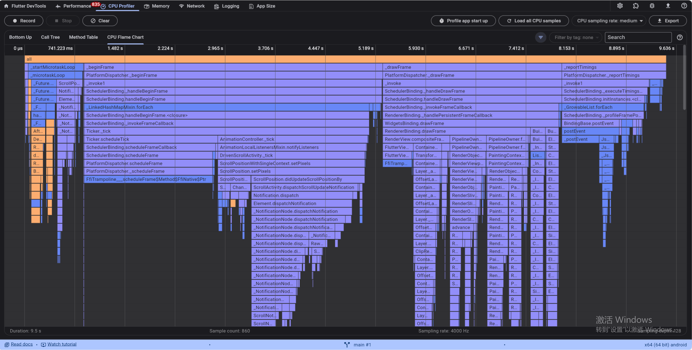
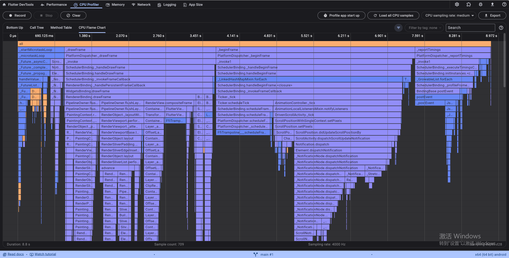

# r2f_x3dh_e2e

r2f_x3dh_e2e is a Rust to Flutter library enabling end-to-end encryption using the X3DH protocol, establishing shared secret keys for secure communication.

## Motivation

In today's digital landscape, ensuring the privacy and security of sensitive data is of paramount importance. End-to-end encryption is a powerful technique that guarantees the confidentiality and integrity of data exchanged between communicating parties. However, implementing end-to-end encryption can be a complex task, requiring expertise in both cryptography and software development.

The motivation behind the r2f_x3dh_e2e library is to simplify the process of integrating robust end-to-end encryption into Flutter applications. By leveraging the strengths of Rust and Flutter, this library offers a seamless and efficient solution for developers seeking to incorporate secure communication features in their applications.

## Testing Results in Profile Mode
Based on the performance tests conducted in profile mode, the Rust implementation exhibited a substantial increase in frames per second (FPS), with performance improvements of up to 49 FPS. Similarly, the Dart implementation also demonstrated notable enhancements, achieving an improvement of up to 40 FPS. These results indicate that both Rust and Dart have shown promising optimizations, resulting in higher FPS values and improved overall performance.
### Comparison of CPU Profile
| Profile Type | Image |
|--------------|-------|
| r2f_x3dh_e2e |  |
| dart_x3dh_e2e |  |

### Comparison of Performance
| Profile Type | Image |
|--------------|-------|
| r2f_x3dh_e2e |  |
| dart_x3dh_e2e |  |

### Comparison of Memory
| Profile Type | Image |
|--------------|-------|
| r2f_x3dh_e2e |  |
| dart_x3dh_e2e |  |

## Features

- Seamless integration of Rust's cryptography capabilities within Flutter applications.
- Implements the X3DH protocol for strong security guarantees, including confidentiality and integrity of encrypted data.
- Supports key generation, encryption, and decryption functions.
- Accommodates both byte array and hexadecimal string-based keys.
- Simplifies the process of incorporating secure end-to-end encryption into Flutter applications.

## Advanced Testing

The [rust_x3dh_e2e](https://github.com/hkk97/rust_x3dh_e2e) and [dart_x3dh_e2e](https://github.com/hkk97/dart_x3dh_e2e) projects employ advanced testing techniques to ensure the reliability and security of their implementations. The testing process includes the following:

- **Unit tests:** Comprehensive unit tests are written to verify the correctness of individual functions and components.
- **Integration tests:** Integration tests are performed to ensure the seamless integration between the Rust and Flutter components of the library.
- **End-to-end tests:** End-to-end tests may be conducted to validate the encryption and decryption process, ensuring the privacy and data integrity of the communication.

Test coverage reports and test suite execution results can be used to assess the effectiveness and comprehensiveness of the testing approach.

## Implementation Methods

The [rust_x3dh_e2e](https://github.com/hkk97/rust_x3dh_e2e) project is implemented in Rust, a programming language known for its focus on safety, performance, and concurrency. The use of Rust ensures that the implementation is memory-safe and provides efficient execution.

The [dart_x3dh_e2e](https://github.com/hkk97/dart_x3dh_e2e) project, on the other hand, is implemented in Dart, a language commonly used for developing cross-platform mobile applications. Dart offers a rich set of libraries and frameworks for building secure and performant applications.

Both projects leverage the Extended Triple Diffie-Hellman (X3DH) key agreement protocol, a cryptographic protocol used for establishing shared encryption keys between two parties. This protocol ensures secure key exchange and confidentiality of the communication.

The [dart_x3dh_e2e](https://github.com/hkk97/dart_x3dh_e2e) project utilizes the Flutter Rust-Bridge, which is a mechanism that allows integrating Rust code into Flutter applications. This combination enables the benefits of both Dart and Rust in terms of cross-platform development and high-performance cryptography.

By combining the power of Rust and Dart, the [rust_x3dh_e2e](https://github.com/hkk97/rust_x3dh_e2e) and [dart_x3dh_e2e](https://github.com/hkk97/dart_x3dh_e2e) projects aim to provide robust and secure end-to-end encryption solutions using the X3DH protocol. The advanced testing methodologies employed in these projects ensure the reliability, privacy, and data integrity of the communication process.

## Getting Started

To use r2f_x3dh_e2e in your Flutter project, follow these steps:

1. Add the library as a dependency in your `pubspec.yaml` file:
    ```yaml
    dependencies:
      r2f_x3dh_e2e: ^0.0.2
    ```

2. Import the library in your Dart code:
    ```dart
    import 'package:r2f_x3dh_e2e/r2f_x3dh_e2e.dart';
    ```

3. Refer to the `example/pubspec.yaml` file in the project repository for usage instructions and code examples. It provides a working example demonstrating the usage of r2f_x3dh_e2e.

For detailed usage instructions and examples, please refer to the documentation.

## Usage

Import the required packages:

```dart
import 'package:r2f_x3dh_e2e/models.dart';
import 'package:r2f_x3dh_e2e/r2f_x3dh_e2e.dart';
```

Initialize the library:

```dart
final r2fX3DHE2ESer = R2FX3DHE2ESer();
await r2fX3DHE2ESer.init();
```

### Encryption

Encrypt data using a shared secret key represented as a list of integers:

```dart
final encryptedMsg = await r2fX3DHE2ESer.encryptWithBytesKey<EncryptedMsg>(
  x3DHKey: [1, 2, 3, 4, 5], // Shared secret key
  data: 'Hello, World!', // Data to be encrypted
);

// Access the encrypted message properties
final ciphertext = encryptedMsg.ciphertext;
final iv = encryptedMsg.iv;
```

Encrypt data using a shared secret key represented as a hexadecimal string:

```dart
final encryptedMsg = await r2fX3DHE2ESer.encryptWithHexStringKey<EncryptedMsg>(
  x3DHKey: 'dad2dae999b40bfe4a60881771e87880511ddb0b6bbd503ddddbb4ae22b34ff1', // Shared secret key as a hexadecimal string
  data: 'Hello, World!', // Data to be encrypted
);

// Access the encrypted message properties
final ciphertext = encryptedMsg.ciphertext;
final iv = encryptedMsg.iv;
```

### Decryption

Decrypt a message using a shared secret key represented as a hexadecimal string:

```dart
final decryptedData = await r2fX3DHE2ESer.decryptWithHexStringKey(
  x3DHKey: 'dad2dae999b40bfe4a60881771e87880511ddb0b6bbd503ddddbb4ae22b34ff1', // Shared secret key as a hexadecimal string
  ciphertext: [1, 2, 3, 4, 5], // Ciphertext as a list of integers
  iv: [10, 20, 30, 40, 50], // Initialization vector as a list of integers
);

// Access the decrypted data
print(decryptedData);
```

## Models

The `r2f_x3dh_e2e` library provides the following models:

### X3DHKey

Represents an X3DH shared secret key.

Properties:
- `hexStr` (String): Hexadecimal string representation of the key.
- `bytes` (List<int>): List of integers representing the key.

### UniEncryptedMsg

Represents an encrypted message with additional X3DH key information.

Properties:
- `ciphertext` (Uint8List): Encrypted data.
- `iv` (Uint8List): Initialization vector.
- `x3dhKey` (X3DHKey): X3DH shared secret key.

### EncryptedMsg

Represents an encrypted message.

Properties:
- `ciphertext` (Uint8List): Encrypted data.
- `iv` (Uint8List): Initialization vector.

## Contribution

Contributions to r2f_x3dh_e2e are welcome! If you encounter any issues or have suggestions for improvements, please open an issue or submit a pull request. We appreciate your feedback and contributions.

## License

r2f_x3dh_e2e is licensed under the [MIT License](LICENSE).

## Project Repositories

- [dart_x3dh_e2e](https://github.com/hkk97/dart_x3dh_e2e): Repository for the Dart implementation of the X3DH end-to-end encryption library.
- [rust_x3dh_e2e](https://github.com/hkk97/rust_x3dh_e2e): Repository for the Rust implementation of the X3DH end-to-end encryption library.
